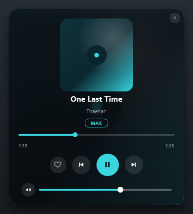
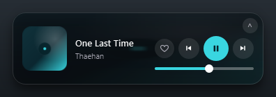

# TIDAL Now-Playing Widget

A polished "dark glass" desktop widget for Windows that shows what's currently
playing on **TIDAL** (cover art, title, artist) with transport controls, a
compact/expanded view, and a system-tray menu. It reads playback straight from
Windows, so there are no API keys, no login, and no configuration required to
get going.


<p align="center">
  
  
</p>

> **Disclaimer:** This is an unofficial, third-party tool. It is not affiliated
> with, endorsed by, or sponsored by TIDAL or Aspiro AB. "TIDAL" is a trademark
> of its respective owner and is used here only to describe compatibility.

## Features

- Live cover art, title, and artist, updating within about half a second of a track change
- Play / pause, next, and previous controls
- Compact bar and expanded card, toggled by button, double-click, or tray menu
- Blurred album-art ambient background for the signature "dark glass" look
- Configurable transparency and accent color
- Seekable progress bar (drag to scrub) in the expanded view
- Shuffle and repeat toggles, shown when the current source supports them
- System-tray icon with full controls and quit
- Heart button to favorite the playing track to your TIDAL collection (optional, one-time sign-in)
- Quality badge showing what the track is available in on TIDAL (MAX / Hi-Res / Lossless / High, plus Atmos)
- Adaptive controls: actions the current source doesn't support are greyed out or hidden
- Preferences dialog, run-at-Windows-startup, and optional global hotkeys
- Frameless, always-on-top, and stays out of the taskbar
- Drag to reposition; locks into the nearest screen corner on release
- Ships as a single standalone `.exe`, no Python needed to run it

## How it works

The widget reads the active session from the Windows **System Media Transport
Controls (SMTC)**, the same mechanism behind the volume-flyout media controls.
Any app that integrates with SMTC publishes its now-playing metadata and accepts
transport commands through it, including the TIDAL desktop app. That means no
OAuth, no API keys, and it works the moment TIDAL is playing. If TIDAL is not
running, it can optionally follow whatever else is playing (Spotify, a browser,
and so on).

## Requirements

- Windows 10 or 11
- The TIDAL desktop app (running and playing)
- Only to run from source or build it yourself: Python 3.10+ (the prebuilt `.exe` needs neither)

## Get it

### Option A: Download the .exe (easiest)

1. Download the latest `TidalNowPlaying.exe` from the
   [Releases](https://github.com/gullyous/tidal-widget/releases/latest) page.
2. Open TIDAL and play a track.
3. Double-click the `.exe`. The first launch takes a few seconds while it unpacks.

The app is unsigned, so Windows SmartScreen may show a warning the first time.
Click **More info -> Run anyway**, or build it yourself (below) if you prefer.

### Option B: Run from source

1. Install Python 3.10+ (tick **Add Python to PATH**).
2. Open TIDAL and play a track.
3. Double-click **`run.bat`** (it creates a virtual environment, installs
   dependencies, and launches). Use **`run-debug.bat`** to see logs and a
   backend self-test.

## Build your own .exe

Double-click **`build.bat`**, or run:

```bat
pip install -r requirements.txt pyinstaller
python make_icon.py
pyinstaller --noconfirm --onefile --windowed --name TidalNowPlaying --icon icon.ico --collect-all winsdk --collect-all tidalapi --collect-all pynput main.py
```

The result is `dist\TidalNowPlaying.exe`.

## Usage

- **Move it:** drag anywhere on the card; on release it locks into the nearest screen corner.
- **Resize:** double-click the card, or use the chevron in the top-right corner, to switch between compact and expanded.
- **System tray:** left-click the tray icon to show or hide the widget; right-click for a menu with the current track, play/pause, next, previous, show/hide, expand/compact, and quit.
- **Quick menu:** right-click the card for expand/compact, hide to tray, and quit.
- **Seek:** in expanded mode, drag the progress bar to jump to any point in the track.
- **Shuffle / repeat:** toggle buttons appear in expanded mode when the player supports them. (TIDAL does not expose shuffle/repeat to Windows, so they stay hidden for TIDAL.)
- **Settings:** right-click the tray icon and choose **Settings...** for accent, opacity, refresh interval, run-at-startup, and hotkeys.
- **Global hotkeys** (when enabled): Ctrl+Alt+Space play/pause, Ctrl+Alt+Left/Right prev/next, Ctrl+Alt+L like, Ctrl+Alt+H show/hide.
- **Heart (like):** click the heart to add the current track to your TIDAL collection. The first time, sign in once via the tray menu ("Sign in to TIDAL"). See below.

## Liking tracks (TIDAL collection)

The heart adds the current track to your TIDAL collection (favorites). Because
Windows media controls have no "favorite" command, this talks to TIDAL directly:

- **One-time sign-in:** right-click the tray icon and choose **"Sign in to TIDAL"**.
  A TIDAL page opens in your browser; approve it once. The login token is stored
  locally in `%APPDATA%\TidalWidget\` and refreshed automatically, so you never
  sign in again. Nothing is sent anywhere except to TIDAL.
- **Click the heart** to add the playing track; click again to remove it. A tray
  notification confirms what changed.
- **Matching:** the now-playing track is matched to TIDAL's catalog by title and
  artist. If it cannot find a confident match it tells you rather than guessing.
- This feature is **optional**: it needs the `tidalapi` package (bundled into the
  `.exe`). Without it, the heart simply prompts you to sign in.

### Track quality

The expanded card shows a badge for the best quality the current track is
**available in** on TIDAL (MAX, Hi-Res, Lossless, High, plus an Atmos tag). It
needs the same sign-in and title/artist match as the heart.

Important: this is **catalog availability, not the quality you are currently
streaming**. Windows and TIDAL do not expose the live stream quality to other
apps, and the actual streaming quality can only be changed inside TIDAL itself
(tray menu -> "Open TIDAL (change quality)", then TIDAL > Settings > Streaming).

## Configuration

Most of these are editable live from the tray **Settings...** dialog (saved per-user
and remembered across launches). `config.py` holds the defaults; edit it and relaunch
if you prefer.

| Setting | Default | What it does |
|---|---|---|
| `MATCH_APP` | `"tidal"` | Which app's session to follow (matched against the app id). |
| `FALLBACK_TO_ANY` | `True` | If TIDAL is not playing, follow any other player (Spotify, a browser, etc.). |
| `POLL_MS` | `500` | How often to refresh now-playing info, in milliseconds. |
| `ACCENT` | `"#39d6e0"` | Accent color for the play button and progress bar. |
| `START_EXPANDED` | `False` | Start in the larger expanded card. |
| `ALWAYS_ON_TOP` | `True` | Keep the widget above other windows. |
| `BACKGROUND_OPACITY` | `0.82` | Panel transparency (0.0 = clear, 1.0 = solid); text and controls stay opaque. |
| `WINDOW_OPACITY` | `1.0` | Fade the entire widget, text included. Lower for a fully ghosted look. |
| `HOTKEYS_ENABLED` | `True` | Enable system-wide global hotkeys (needs `pynput`). |

## Project structure

| File | Role |
|---|---|
| `main.py` | Entry point; wires the backend worker to the widget. |
| `widget.py` | The UI: card, compact/expanded modes, tray icon, transparency. |
| `media_backend.py` | SMTC reader and transport (play/pause/next/prev/seek/shuffle/repeat), on a worker thread. |
| `tidal_likes.py` | Optional TIDAL favorites (heart): OAuth login + add/remove, on background threads. |
| `icons.py` | Transport and app icons drawn at runtime with QPainter. |
| `config.py` | Default user settings (see above). |
| `settings.py` | Persisted settings (QSettings) + run-at-startup management. |
| `settings_dialog.py` | The preferences dialog. |
| `hotkeys.py` | Optional global hotkeys (pynput). |
| `make_icon.py` | Generates `icon.ico` for the packaged app. |
| `build.bat` | One-click build of the standalone `.exe`. |
| `run.bat` / `run-debug.bat` | Run from source (with or without a console). |
| `requirements.txt` | Python dependencies (PySide6, winsdk, tidalapi, pynput). |

## Troubleshooting

- **"Nothing playing":** open TIDAL and press play. SMTC only reports while a media session exists.
- **Can't find the window:** by design it has no taskbar button. Use the tray icon (left-click to show), or it sits in the bottom-right corner by default.
- **SmartScreen / antivirus warning:** expected for an unsigned PyInstaller binary. Use **More info -> Run anyway**, or build it yourself.
- **Need logs:** run `run-debug.bat`, or `python media_backend.py` to print the current track and album-art byte count.

## Tech and acknowledgements

- [PySide6](https://doc.qt.io/qtforpython/) (Qt for Python), licensed under LGPLv3
- [winsdk](https://github.com/pywinrt/python-winsdk) (Python WinRT projection), licensed under MIT
- [tidalapi](https://github.com/tamland/python-tidal) (unofficial TIDAL API client) for the optional favorite feature, licensed under LGPLv3
- [pynput](https://github.com/moses-palmer/pynput) for optional global hotkeys, licensed under LGPLv3
- Icons are drawn at runtime with QPainter, so there are no image assets to ship

Because the packaged `.exe` bundles PySide6 (LGPLv3), the full source for this
project is published here so the Qt components remain replaceable, as LGPL
intends.

## Credits

Made by **[gullyous](https://github.com/gullyous)**.

## License

Released under the **GNU General Public License v3.0**. See the [LICENSE](LICENSE)
file for the full text.

This is free software: you can redistribute it and/or modify it under the terms
of the GPL, version 3 or (at your option) any later version. It comes with no
warranty. Versions up to and including 1.0.0 were released under the MIT License.
